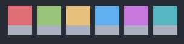
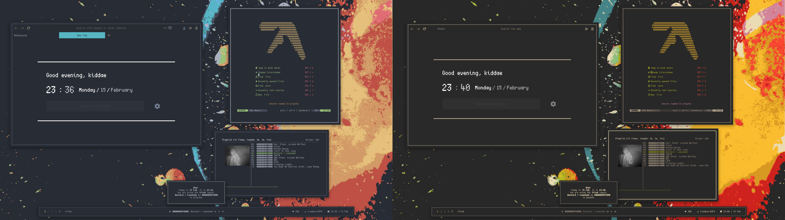

# Generate wallpapers and images using `ImageColorizer`!

It's a Python module and a CLI tool that you can easily use to colorize wallpapers for them to fit a colorscheme.
Currently supports importing colorschemes from the currently set `Xresources` variables and `colorer` (my [colorscheme management engine](https://github.com/ngynLk/colorer)).

Using the OneDark colorscheme:




Original/OneDark


OneDark/Gruvbox

# Usage

```
usage: ImageColorizer [-h] [-x] [-c COLORER] [-s] input output

positional arguments:
  input                 File to generate image from.
  output                File to generate image to.

optional arguments:
  -h, --help            show this help message and exit
  -x, --xresources      Get palette from Xresources.
  -c COLORER, --colorer COLORER
                        Get palette from colorer.
  -s, --show            Show image using xdg-open when image is generated.
```

# Installation

Clone the repo and run `./install.sh`. You can also run `pip3 install .`

# Todo

+ Implement multi-threading (I don't have enough knowledge yet to do it)
+ More colorscheme importing options

# Troubleshoot

Any common fixes to any errors will be added here.

# Credits

Heavily inspired by [ImageGoNord](https://github.com/Schrodinger-Hat/ImageGoNord-pip)
