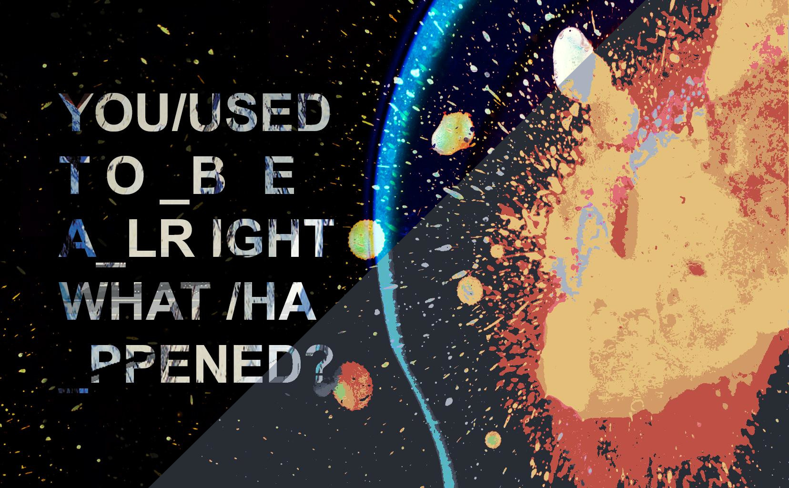
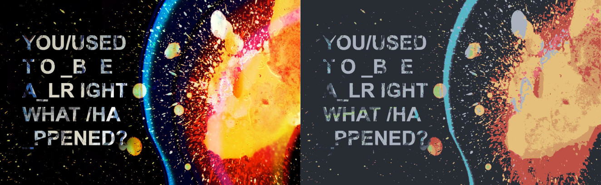
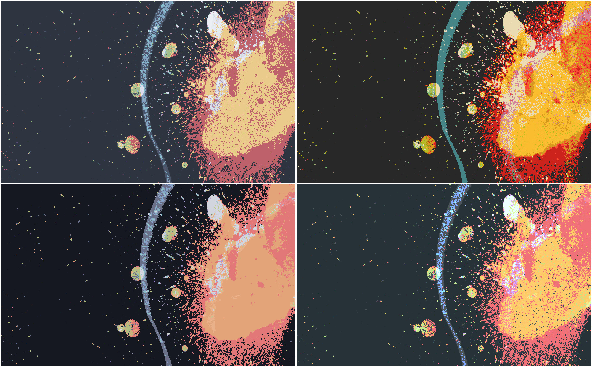
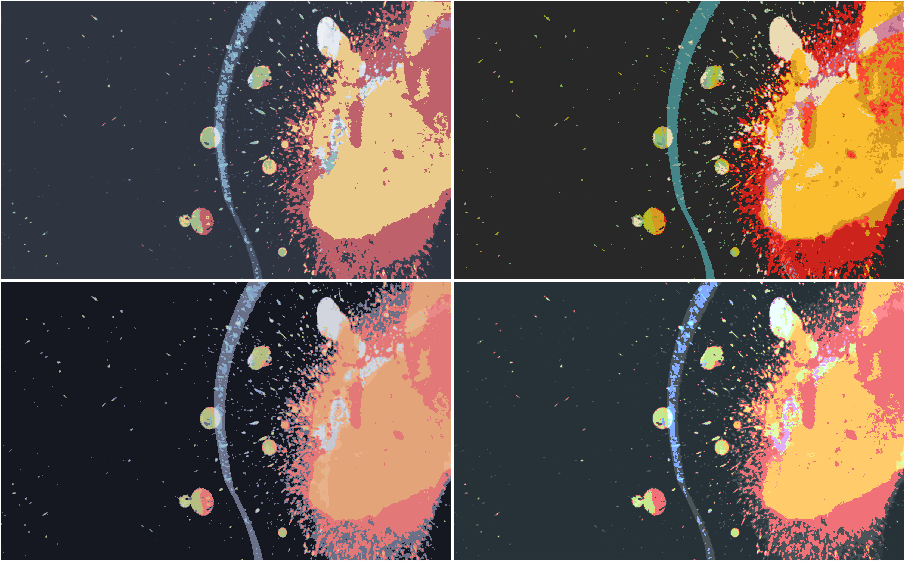

# Generate wallpapers and images using `ImageColorizer`!

It's a Python module, and a CLI tool that you can easily use to colorize wallpapers for them to fit a colorscheme.
Currently supports importing colorschemes from the currently set `Xresources` variables and `colorer` (my [colorscheme management engine](https://github.com/ngynLk/colorer)).

These examples use the OneDark colorscheme:





It can use two different algorithms:
+ pixel by pixel algorithm, goes through each pixel and replaces it with the right color from the colorscheme
+ average algorithm, calculates the average color of each pixel before. This one gives smoother and better results in some cases.


Pixel by pixel


Average

# Usage

```
usage: ImageColorizer [-h] [-x] [-c COLORSCHEME] [-w] [-p COLOR [COLOR ...]] [-s]
                      [-b] [--average BOX_SIZE] [--no_quantize]
                      input output

positional arguments:
  input                 File to generate image from.
  output                File to generate image to.

optional arguments:
  -h, --help            show this help message and exit
  -x, --xresources      Get palette from Xresources.
  -c COLORSCHEME, --colorer COLORSCHEME
                        Get palette from colorer.
  -w, --pywal
                        Gets palette from pywal.
  -p COLOR [COLOR ...], --palette COLOR [COLOR ...]
                        Manually set colors.
  -s, --show            Show image using xdg-open when image is generated.
  -b, --blur            Blur the image
  --average BOX_SIZE    Use average algorithm (calculate the average color of
                        each pixel with the pixels around) to generate the
                        wallpaper, and set the size of the box to calculate
                        the color from
  --no_quantize         Do not quantize the image before processing (may make
                        the image look better)

```

## Examples

```shell
ImageColorizer a.jpg output.jpg -x # Generate the wallpaper from colors of the currently used ~/.Xresources or ~/.Xdefaults file
ImageColorizer a.jpg output.jpg -c nord # Generate the wallpaper using colorscheme nord from colorer
ImageColorizer a.jpg output.jpg -c nord --average 2 # Use average algorithm with box size of 2
ImageColorizer a.jpg output.jpg -c nord --average 2 -s # Show image at the end
ImageColorizer a.jpg output.jpg -p "#3b4252" "#bf616a" "#a3be8c" -s # Use these colors.
```

# Installation

Install `python` first.
Clone the repo and run `./install.sh`. You can also run `pip3 install .` This will install the right dependencies for you.

# Todo

+ Implement multi-threading (I don't have enough knowledge yet to do it)
+ More colorscheme importing options

# Troubleshoot

Any common fixes to any errors will be added here.

# Credits

Heavily inspired by [ImageGoNord](https://github.com/Schrodinger-Hat/ImageGoNord-pip)
